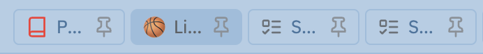

# Shrink pinned tabs

_Link to plugin: [click here](https://github.com/nicosomb/obsidian-shrink-pinned-tabs)_

---

Iconize and Shrink pinned tabs work together. 

With Shrink pinned tabs, you can choose if you want to display the tab title or not. 

## Iconize and Shrink pinned tabs with title 

## Iconize and Shrink pinned tabs without title 

