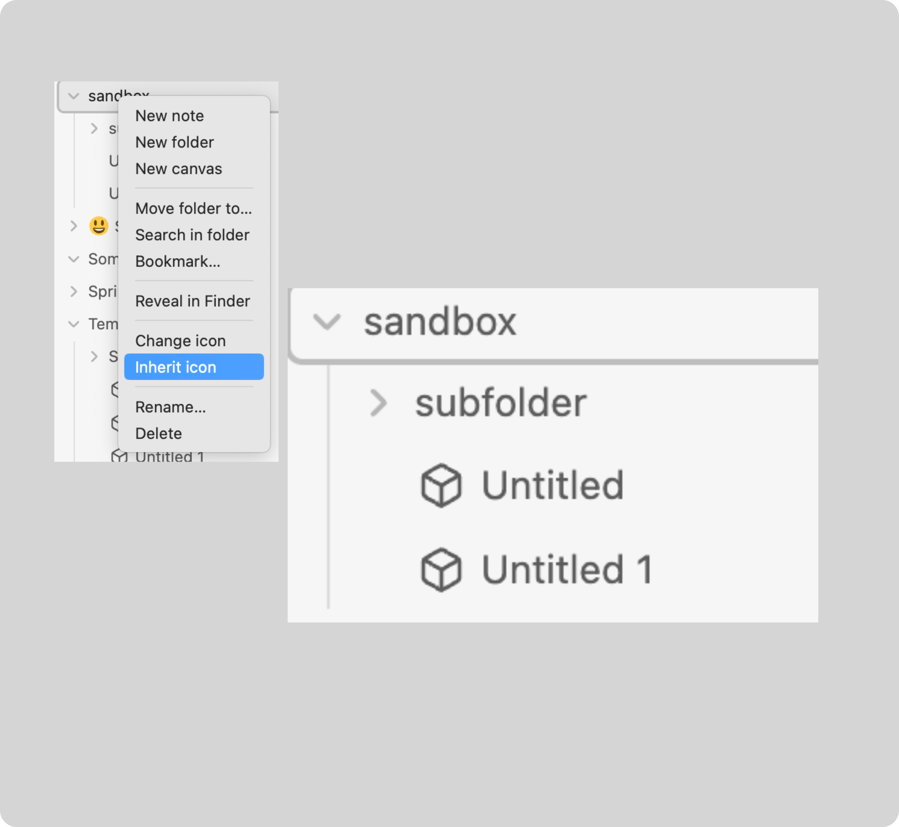

# Inheritance

<Badge type="info" text="Deprecated since v2.10.0. Use custom rules instead" />

Inheritance allows to add icons for a specific folder to all the files that are
only at the root of the folder. That means that that all root files in a folder
will have an icon, if inheritance is applied.

After clicking the `Inherit icon` menu item, a icon modal will pop up where
you can select the icon you want for the inheritance. After that, all the files
have the icon.

