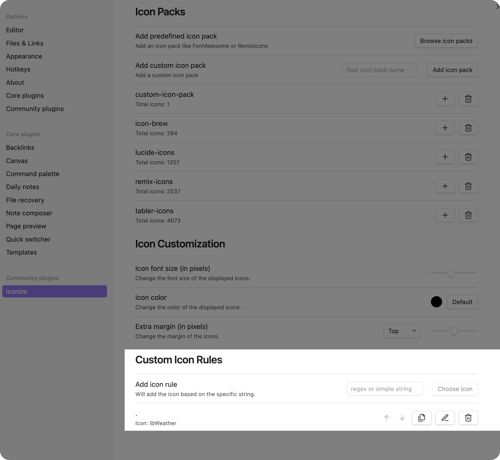

# Custom Rules

*Documentation Coming Soon*

## Use Cases

This section of the documentation will show you some use cases for custom rules.

### Having a default icon

You can use custom rules to have a default icon for all files and folders. This is useful
if you want to have a default icon for all files and folders and only change the icon for
some of them.

You can easily set a default icon by applying a custom rule to your vault. You simply need
to add a custom rule with the input `.`, so that it looks like this:

After that, you can select the icon you want to use as a default icon. This icon will be
used for all files and folders that don't have a custom icon.
