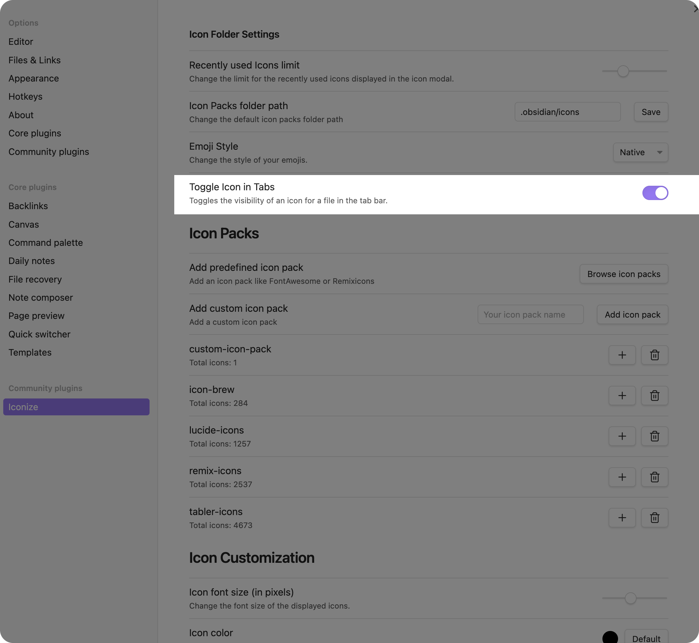

# Icon in Tabs

Make sure, that you've enabled the setting which is related to activating icons in tabs.
Please refer to the [Settings](../guide/settings.md) documentation for more information 
about this and other options.

Tabs can have icons next to the title of the opened file. To add an icon to a tab, you
just need to add an icon to a file and the tab will automatically show it.
