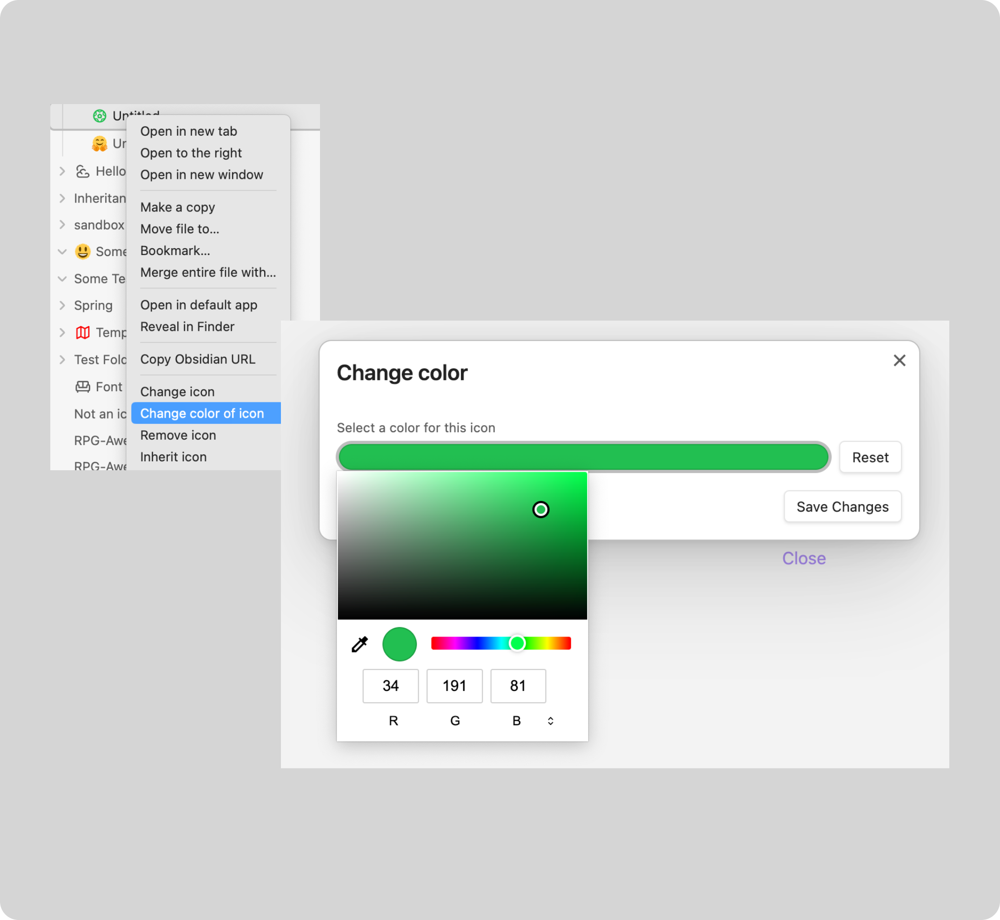

# Change individual icon color

If you would like, you can also set an individual icon color for your icon,
that is set to a file or folder.

For that you simply need to `Right click on your file/folder which contains an
icon > Change color of icon`. Within the next modal, you can set or reset the
color of the icon. Resetting means, setting the icon color to be the default
editor color.

