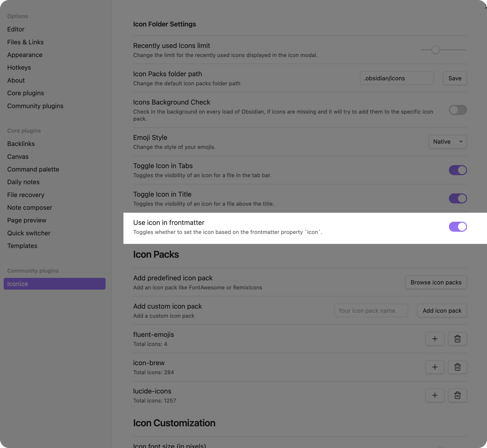

# Use Frontmatter

If you want to use a frontmatter property to set the icon, you can follow this
guide.

First of, you need to enable the properties option, so that Iconize can read
your frontmatter values.



After that you can feel free to use the frontmatter property `icon` on any file
to customize the icon for this file.

For example, you can use the following frontmatter to set the icon for a
specific file:

```markdown
---
icon: IbBell
---
```

