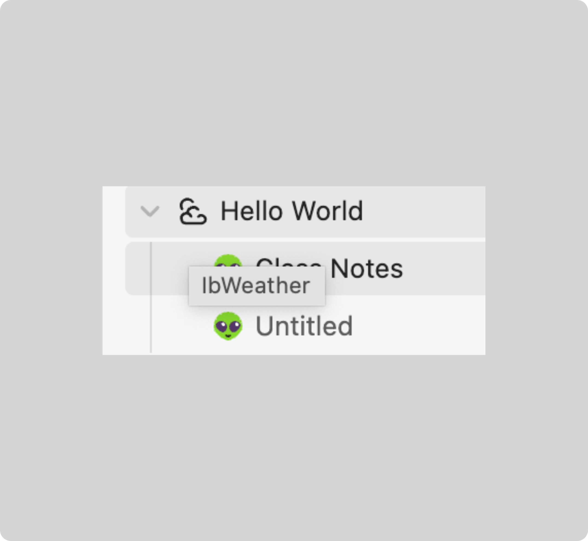

# See icon name of file or folder

If you've ever wondered which icon you've used for this specific file or folder
and it does not exist in your most recently used icons, you can simply hover
over the icon (and wait some time) to see the icon name. It will be in the
following format: `<icon-pack-prefix><icon-name>` (e.g., `IbCalendar`).

It can look like the following:

