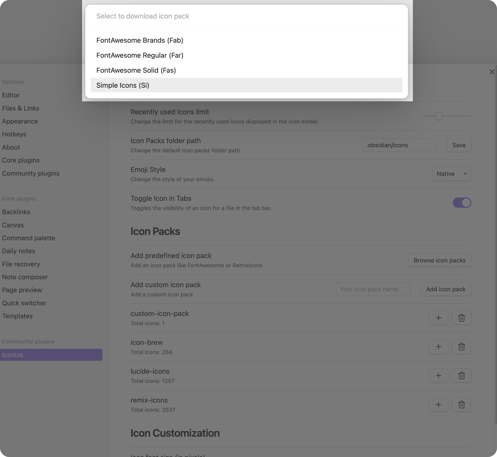
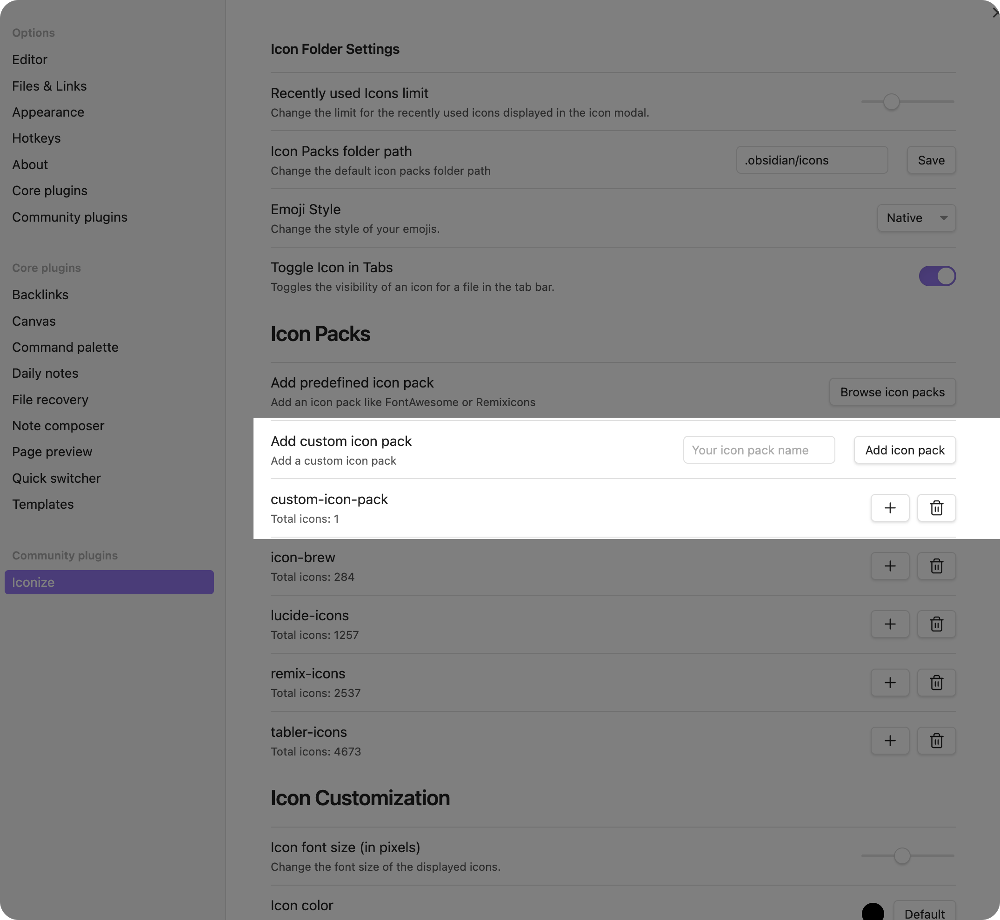
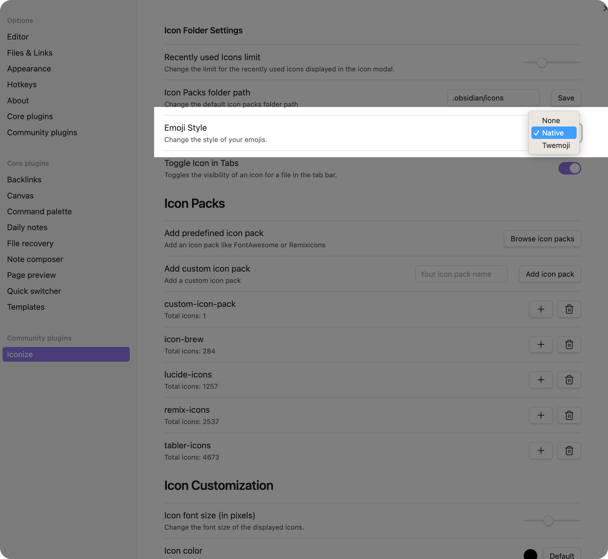

# Icon Packs

Iconize comes with some predefined icon packs. However, you can also add your own icon
packs. This section of the documentation will show you how to do that, but also how to use
the predefined icon packs and emojis.

## Predefined Icon Packs

To use a predefined icon pack, you can go to the settings of the plugin and select
`Browse icon packs` and then select the icon pack you want to use. So that the following
modal will open:

After you have selected the icon pack you want to use, it will download the icon pack and
then you can use it in your vault.

Currently, Iconize supports the following predefined icon packs:

- [Font Awesome](https://fontawesome.com/)
- [Remix Icons](https://remixicon.com/)
- [Icon Brew](https://iconbrew.com/)
- [Simple Icons](https://simpleicons.org/)
- [Lucide Icons](https://lucide.dev/)
- [Tabler Icons](https://tabler-icons.io/)

If you want to add a predefined icon pack or you would like to update an existing one,
feel free to open a pull request on
[GitHub](https://github.com/FlorianWoelki/obsidian-iconize/compare).

## Custom Icon Packs

::: tip NOTE

This feature is currently not 100% available and stable. If you want to use it, you can
do that, but it might be that some things are not working as expected. Furthermore, there
might be some breaking changes in the future.

:::

If you want to add your own icon pack, you can do that by using the option `Add icon pack`
in the plugin settings of Iconize. You just need to enter the name of the icon pack.
After that, you can add the icons you want to use in your vault by using the plus icon (`+`) 
next to the custom icon pack.

After you have added the icon pack, you need to zip your custom icon pack by going to the
plugins folder of Obsidian. You can find the plugins folder by going to the settings of
Obsidian and then clicking on `Open plugins folder`. After that, you need to go to the
folder `obsidian-iconize` and then to the folder `icons`. In this folder, you can zip your
custom icon pack. The zip file needs to have the same name as the icon pack you have
entered in the settings of Iconize.

::: tip NOTE

The creation of a zip file needs to be currently done manually. In the future, this will be
automatically done by Iconize. See
[this issue](https://github.com/FlorianWoelki/obsidian-iconize/issues/224) for more
information.

:::

## Using Emojis

If you want to use emojis in your vault, you can do that by using the built-in functionality
of Iconize. You can directly use emojis in the icon picker by searching for them. You can
search for emojis by using the name of the emoji or by using the emoji itself.

Furthermore, you can also adapt the style of the emoji by choosing the emoji style in the
settings of Iconize. You can choose between `None`, `Native`, and `Twemoji`.

