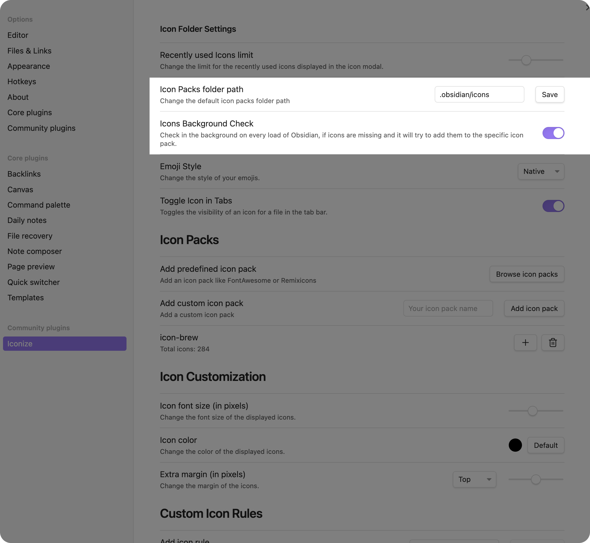

# Syncing

Normally, syncing should work across all devices with established cloud providers.
However, if you want to sync your data across devices with Obsidian Sync and
possibly have thousands of icons, you need to try the following configuration
(detailed discussions can be found
[here](https://github.com/obsidianmd/obsidian-api/issues/134)) for a successful
syncing process:

Try setting the Iconize icon packs folder path to `.obsidian/icons`. Setting the
icon packs path to this specific path **does not** sync the icon packs and you have
to sync them manually. This won't clog up the synchronization process of Obsidian Sync.

You also need to enable the [background checker](#background-checker). Your settings
should look like this:

## Background Checker

::: tip NOTE

The background checker is not only useful for syncing. It is also useful for when you
want to download icons that are set in your vault but are not yet available in the
icon packs.

:::

Next to setting the icon packs path to `.obsidian/icons`, you should also enable the
background checker. This will check if icons are missing and will download them in the
background and extract them to the correct icon pack folder. In addition, it will also
remove unused icon files from the icon packs folder (the icons will still be available).
