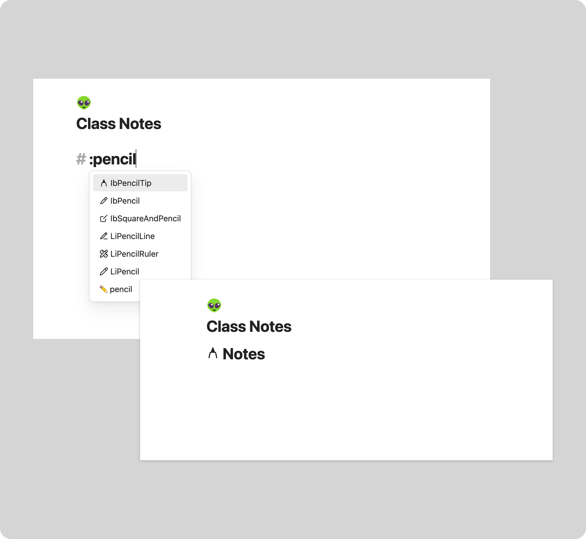

# Icons in Notes

::: tip NOTE

This feature is currently a work in progress. If you want to use it, you can do that, but
it might be that some things are not working as expected. Furthermore, there might be some
breaking changes in the future.

:::

Using icons or emojis in your notes is a great way to make them more visually appealing and
to make them easier to navigate. Obsidian Iconize allows you to do that by just typing
and selecting the icon, without interrupting your workflow.

You can do so, by just typing a `:` and then the name of the icon you want to use.
For example, if you want to use the `:smile:` emoji, you can just type `:smile:` and
then select the emoji from the suggestion list. This also works with all your installed
icon packs in your vault.

At the moment, the icons will only be available in preview mode.

The following screenshot visualizes how this can look like:

