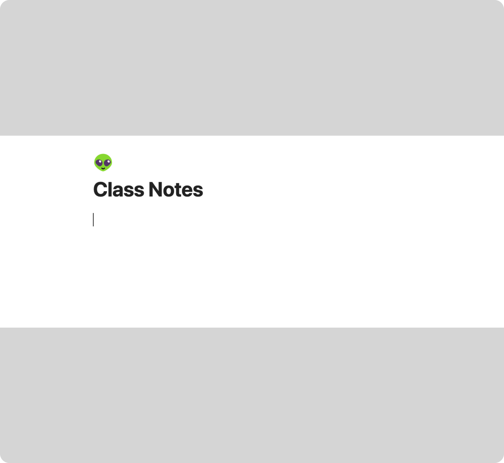
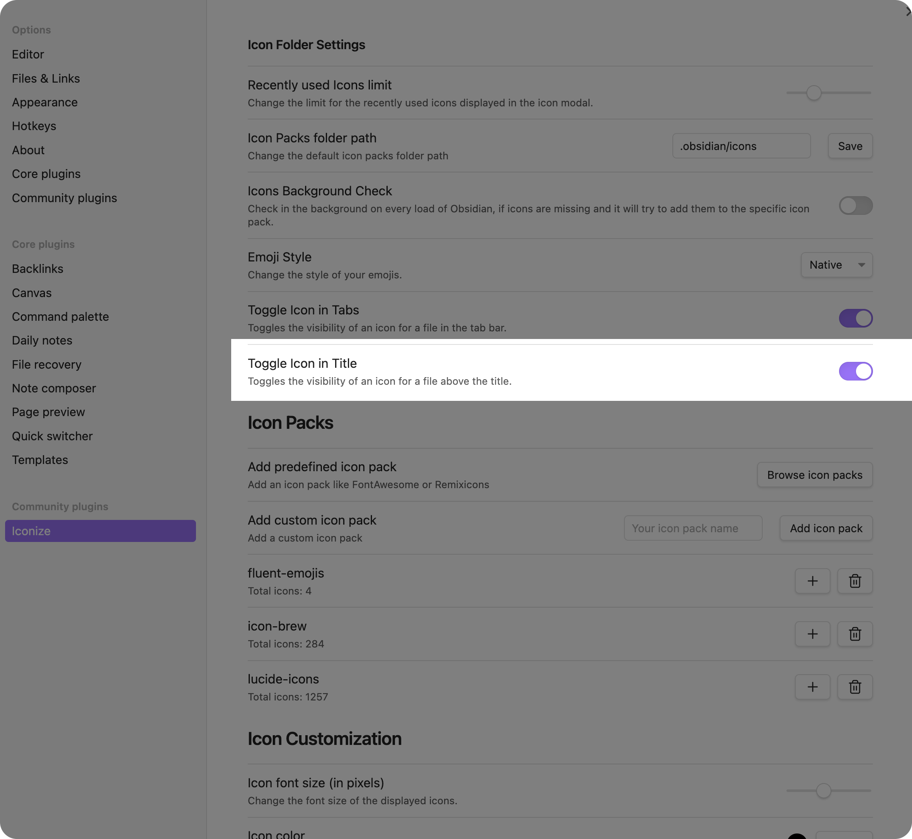

# Icon above Title

If you would like to have a notion-like icon above your title like the following:



You can enable the following setting in the plugin settings:



This will enable the icons above the titles. The icon is taken from the icon of the file.
This feature works with normal icons and custom rules.
The size of the icon is aligned to the size of the title. If you want to change the size
of the icon, you can do so by adding some custom css:

```css
.iconize-title-icon {
    width: 1.5em;
    height: 1.5em;
}
```
